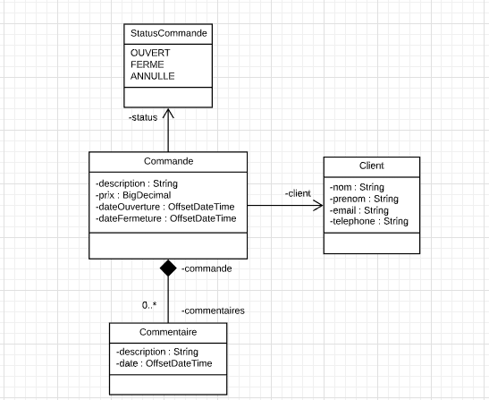
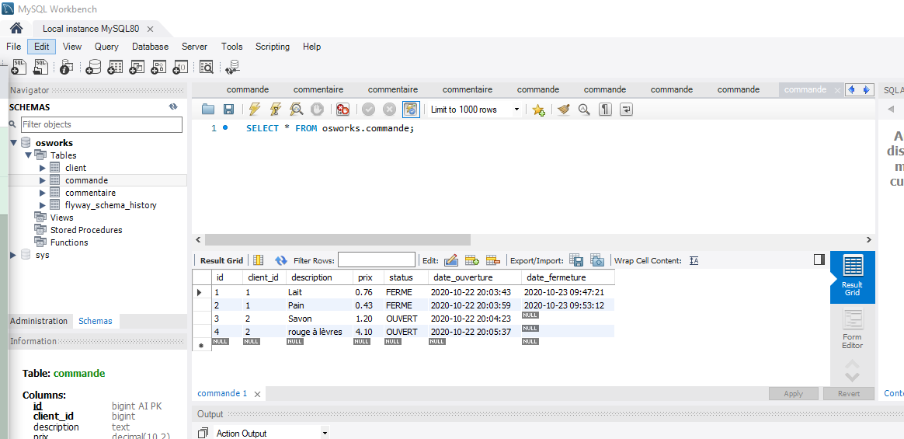
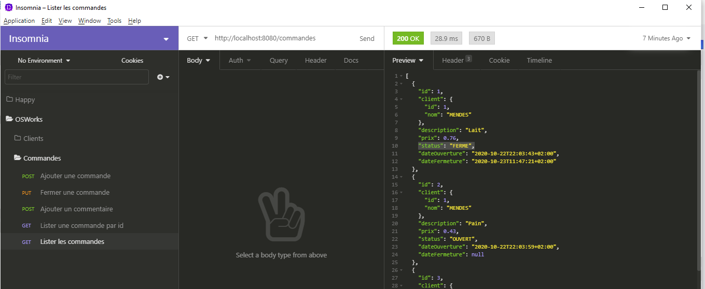
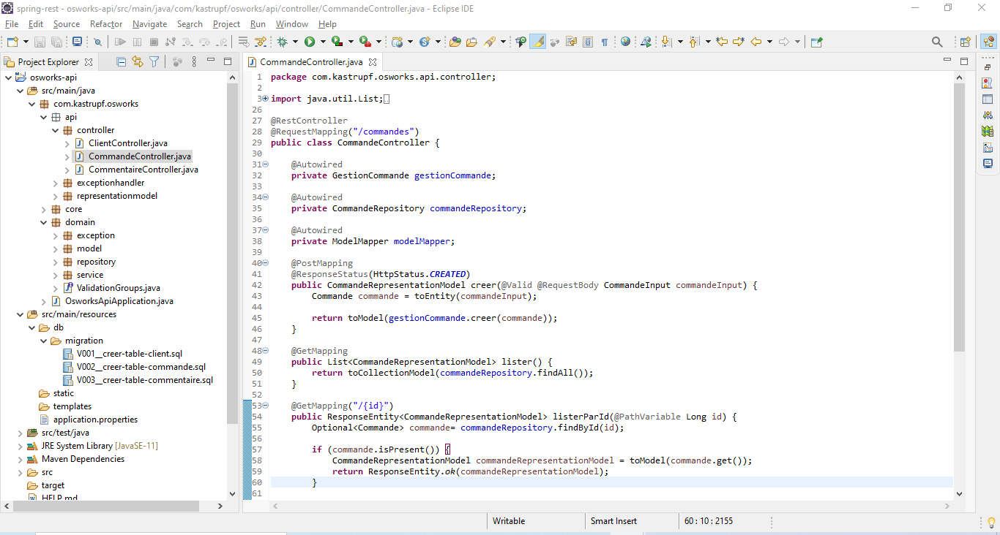

<h1 align="center">OSWorks</h1>

   
   
   
   

 API type : service Web 

 Modèle architectural : REST 

  <a href="#-technologies">Technologies</a>&nbsp;&nbsp;&nbsp;|&nbsp;&nbsp;&nbsp;
  <a href="#-projet">Projet</a>&nbsp;&nbsp;&nbsp;|&nbsp;&nbsp;&nbsp;
  <a href="#-environnement">Environnement</a>&nbsp;&nbsp;&nbsp;|&nbsp;&nbsp;&nbsp;

 
 

 

## 🚀 Technologies

Ce projet a été développé avec les technologies suivantes:

- [Spring](https://spring.io/)
  - [Spring Framework](https://spring.io/projects/spring-framework/)
  - [Spring Data JPA](https://spring.io/projects/spring-data-jpa/)
  - [Spring Boot](https://spring.io/projects/spring-boot/)

- [Jakarta Persistence](https://jakarta.ee/projects/)
- [Flyway](https://flywaydb.org/)
- [Insomnia](https://insomnia.rest/download/)
- [MySQL](https://www.mysql.com/)
  

## 💻 Projet

   
   
   
   

---

## ⚡ Environnement

Pour développer des applications serveur avec Java, vous avez besoin d'installer le [JDK](jdk.java.net/).

Pour le développement d'API:  [Spring Tool Suite](https://spring.io/tools/) ou IDE de votre choix, l'importation du fichier généré par le service [Spring initializr](https://start.spring.io/).

Pour tester les requêtes / réponses générées par l'API: [Postman](https://www.postman.com/downloads/) ou [Insominia](https://insomnia.rest/download/).

Pour la persistance des données: [MySQL Server](https://dev.mysql.com/downloads/mysql/).
Pour l'administration du serveur MySQL: e [MySQL Workbench](https://dev.mysql.com/downloads/workbench/).

D'abord, il faut configurer la connexion avec la base de données. Properties se trouve dans le fichier : /src/main/resources/application.properties.
Par default cette application utilise database(name: osworks, user: root, password: root).

Projet développé au cours de la semaine "Curso de Spring REST pour les débutants" promu par Algaworks, Brésil.
